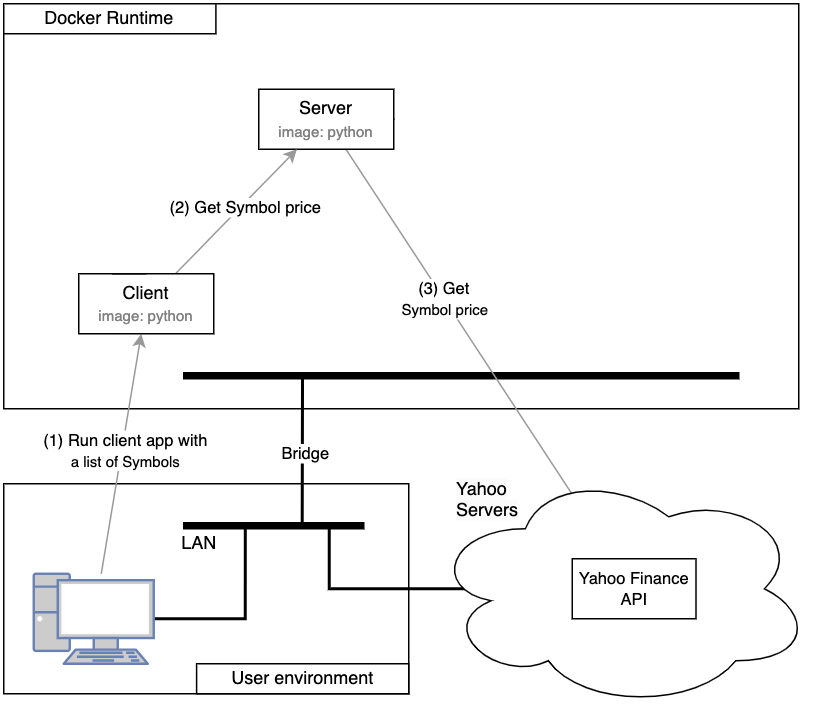

# A Distributed Stock Price Service with Docker (original description)

This system is designed to fetch and display real-time stock prices. The server retrieves stock prices either from a cache or directly from a Yahoo Finance API and handles client requests by providing the current stock prices for the specified symbols. The system is containerized using Docker and is orchestrated using Docker Compose.

## Overview

\
Figure: *System architecture*

- **Server**: Handles requests for stock prices, fetching them from a cache or an API as necessary.
- **Client**: Sends requests to the server to retrieve stock prices for specified stock symbols.
- **Yahoo Finance API**: Returns current price for a stock (Symbol).

## Instructions

> NOTE: You can quickly test the system using the provided `run_test.sh` shell script. It will build **Phase1** and run a simple test. At the end, it will stop all the Docker instances that were started with the docker-compose.yml.

### Running the Server

First, the solution must be build and started. Execute the following command in the `lab-phase1` folder:
    
   ```bash
   docker-compose up -d --build
   ```

### Running a Client Container

You can run a client container to send requests for retrieving stock prices of specific symbols such as PLTR, AMD, AAPL, AAL, NVDA, and F. You can find more symbols at https://finance.yahoo.com/lookup/

```bash
docker-compose run -T --rm client PLTR AMD AAPL AAL NVDA F
```

### Description of Commands

- **`docker-compose up -d --build`**: This command starts the services as defined in the `docker-compose.yml` file in detached mode and builds images before starting containers.
  
- **`docker-compose run -T --rm client ...`**: This command runs a one-off command for a service. It starts a client container, runs the given command (fetching stock prices for specified symbols), and then removes the container after execution.

Ensure that Docker and Docker Compose are correctly installed and configured on your machine before running these commands.